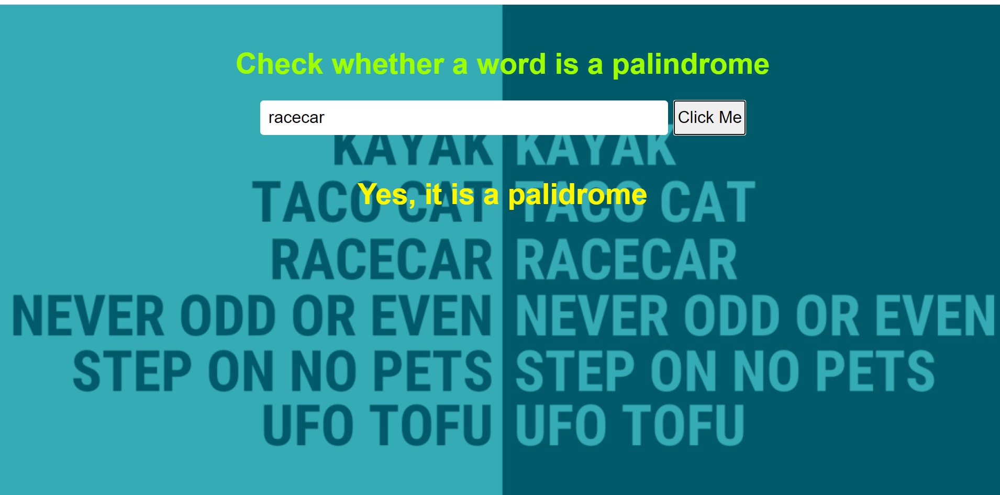

## Palindrome-express

A express app that allows a user is to enter a word and check whether it's a palindrome

## How It's Made:
Tech used: Node.JS, Express.JS, HTML, CSS, JavaScript.

For anyone that doesn't know what a palindrome maybe, it's word that retains the same spelling when read from left to right and the same from right to left.
Examples of these words are: racecar, eye, neon etc
